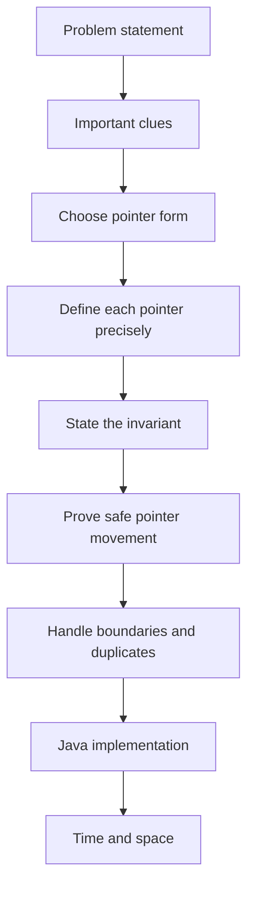
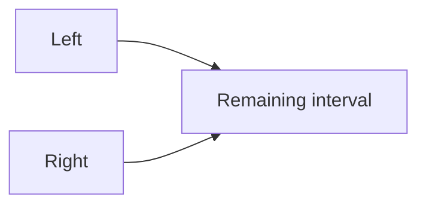
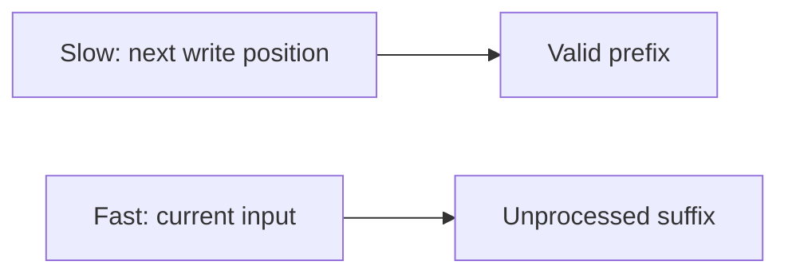
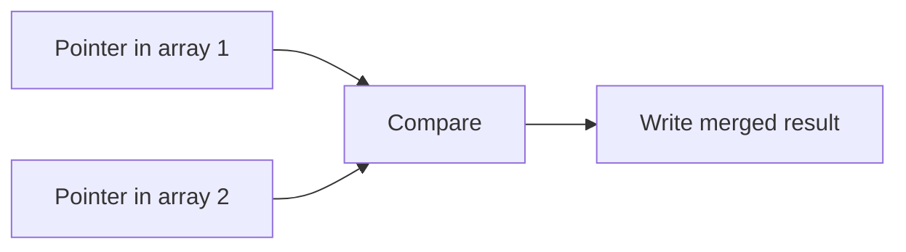
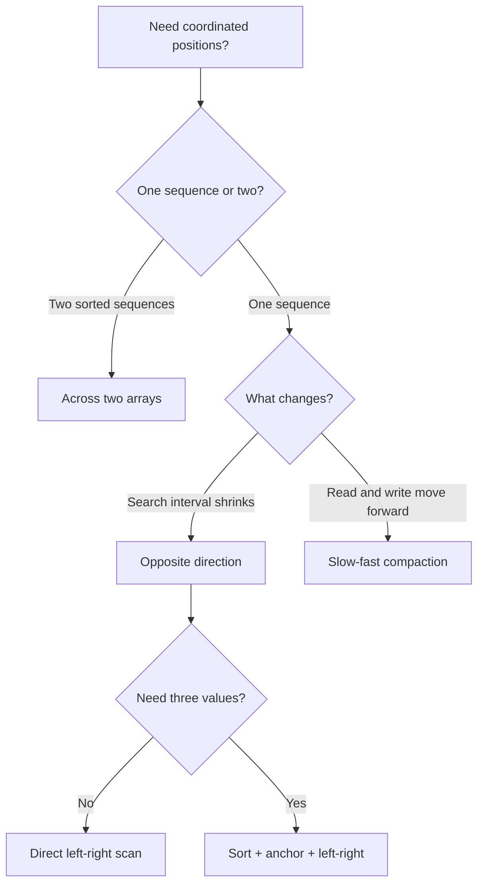

# Two Pointers

Two Pointers is useful when two positions can move through one or more sequences while each movement safely eliminates work that no longer needs to be reconsidered.

Detailed problem-by-problem revision notes are kept separately in [problem-walkthrough.md](problem-walkthrough.md).

## Core Mental Model



The central question is not merely:

```text
Can I use two indices?
```

It is:

```text
After observing the current state, which pointer movement is safe,
and what candidates does that movement prove unnecessary?
```

## Pattern vs Pointer vs Invariant

| Concept | Meaning | Example |
| --- | --- | --- |
| Pattern | Reusable problem-solving strategy | Two Pointers |
| Pointer | Index with a precise responsibility | `left`, `right`, `slow`, `fast`, `write` |
| Invariant | Correctness fact that remains true | Any valid remaining pair is inside `[left, right]` |
| Movement rule | Safe reduction of the remaining work | Sum too small → `left++` |
| Algorithm | Complete steps for a specific problem | Sort, anchor, scan, skip duplicates |

## Three Main Forms

### 1. Opposite-direction pointers



```text
left starts at the beginning
right starts at the end
both move toward the center
```

Use this form when:

- Input is sorted and comparison permits safe elimination.
- Mirrored positions must match.
- The best candidate may come from either endpoint.
- A pair defines an interval, width, or container.

Examples:

- Sorted Two Sum
- Palindrome check
- Squares of a Sorted Array
- Valid Palindrome II
- Container With Most Water
- 3Sum inner search

### 2. Same-direction slow-fast pointers



```text
fast reads every original value
slow maintains the result boundary or next write position
```

Use this form when the problem asks to:

- Remove selected values in place.
- Compact retained values.
- Remove adjacent duplicates from sorted input.
- Preserve the relative order of retained values.

Examples:

- Remove Element
- Remove Duplicates from Sorted Array
- Move Zeroes

### 3. Pointers across two arrays



Use this form when two independently sorted sequences must be:

- Merged
- Compared
- Intersected
- Synchronized

Example:

- Merge Sorted Array

## Pointer Roles Must Be Defined Before Coding

The initialization, comparison, writing, and return value must agree with the pointer definition.

| Pointer meaning | Typical initialization | Typical return |
| --- | ---: | ---: |
| Left boundary | `0` | Problem-dependent |
| Right boundary | `n - 1` | Problem-dependent |
| Next write position / retained count | `0` or `1` | `slow` |
| Last retained index | `0` | `slow + 1` |
| Output position filled from the end | `n - 1` | Output array |
| Last valid value in first input | `m - 1` | Not returned |

Do not mix conventions. If `slow` means next write position, write first and then increment:

```java
nums[slow] = nums[fast];
slow++;
```

## Core Templates

### Opposite-direction pair search

```java
int left = 0;
int right = nums.length - 1;

while (left < right) {
    long value = evaluate(nums, left, right);

    if (value < target) {
        left++;
    } else if (value > target) {
        right--;
    } else {
        return true;
    }
}
```

### Same-direction stable compaction

```java
int slow = 0;

for (int fast = 0; fast < nums.length; fast++) {
    if (shouldRetain(nums[fast])) {
        nums[slow] = nums[fast];
        slow++;
    }
}

return slow;
```

### Merge from the end

```java
int first = m - 1;
int second = n - 1;
int write = m + n - 1;

while (first >= 0 && second >= 0) {
    if (nums1[first] > nums2[second]) {
        nums1[write--] = nums1[first--];
    } else {
        nums1[write--] = nums2[second--];
    }
}

while (second >= 0) {
    nums1[write--] = nums2[second--];
}
```

## Common Invariants

### Shrinking search interval

> At the beginning of every iteration, any valid candidate not already found must lie inside `[left, right]`. Every candidate involving an index outside this interval has been safely eliminated.

### Mirrored comparison

> Before every comparison, all mirrored pairs outside `[left, right]` have already been confirmed equal.

### Stable compaction

> Before processing `fast`, `nums[0 ... slow-1]` contains exactly the accepted values from the original indices `0 ... fast-1`, in their original relative order.

### Filling output from the end

> Before the next comparison, every position after `write` contains the largest values already selected, in its correct final position.

### Fixed anchor plus Two Pointers

> For the current anchor, every valid unexplored pair must lie inside `[left, right]`; all pairs involving discarded boundaries have been eliminated.

## Why Sorting Often Matters

Sorting creates direction:

```text
sum too small → move left to a larger value
sum too large → move right to a smaller value
```

Without ordering, moving a pointer does not predictably change the sum.

Sorting can also:

- Group duplicates together.
- Make local duplicate checks sufficient.
- Put the largest absolute square at one of the endpoints.
- Enable early stopping in 3Sum.

Sorting is not required when pointer movement comes from position rather than value, such as palindrome symmetry or stable compaction.

## Loop Boundary Rules

| Condition | Meaning | Typical use |
| --- | --- | --- |
| `left < right` | Two different indices are required | Pair search, palindrome, container |
| `left <= right` | A final single element must also be processed | Sorted Squares |
| `fast < nums.length` | Inspect every input value | Compaction |
| `first >= 0 && second >= 0` | Both merge inputs still have values | Merge Sorted Array |
| `i < nums.length - 2` | Leave two values after the anchor | 3Sum |

## Complexity Memory Rules

Two pointers usually scan monotonically:

```text
left moves at most n positions
right moves at most n positions
→ O(n), not O(n²)
```

An outer anchor changes the analysis:

```text
n anchors × O(n) two-pointer scan
→ O(n²)
```

Common space results:

```text
Only pointer variables
→ O(1) auxiliary space
```

```text
Required result array of length n
→ O(n) output space, O(1) extra working space
```

```text
Returned list of k triplets
→ O(k) result space
```

## Implemented Problems

- [SortedTwoSum.java](SortedTwoSum.java)
- [ValidPalindrome.java](ValidPalindrome.java)
- [RemoveElement.java](RemoveElement.java)
- [RemoveDuplicatesSortedArray.java](RemoveDuplicatesSortedArray.java)
- [MoveZeroes.java](MoveZeroes.java)
- [SortedSquares.java](SortedSquares.java)
- [MergeSortedArray.java](MergeSortedArray.java)
- [ValidPalindromeII.java](ValidPalindromeII.java)
- [ContainerWithMostWater.java](ContainerWithMostWater.java)
- [ThreeSum.java](ThreeSum.java)

## Common Mistakes

- Using `right = nums.length` instead of `nums.length - 1`
- Using `left <= right` when two different indices are required
- Using `left < right` when the middle value must still be written
- Describing pointer roles instead of stating a correctness invariant
- Moving a pointer without proving why discarded candidates are impossible
- Advancing `slow` without first writing the retained value
- Counting valid values but failing to compact them into the prefix
- Mixing “next write position” with “last retained index” conventions
- Overwriting unprocessed values when merging from the beginning
- Forgetting to copy remaining values from the second merge array
- Treating a write index as an additional search pointer
- Using `^ 2` for squaring in Java; `^` means XOR
- Ignoring equal endpoint values and creating an infinite loop
- Allocating substrings for Valid Palindrome II
- Moving the taller container boundary instead of the shorter one
- Forgetting anchor and pointer duplicate skipping in 3Sum
- Saying (O(1)) space without clarifying whether required output is counted

## Fast Decision Map



## Revision Checklist

- Can I name the pointer form before coding?
- Can I define exactly what every pointer represents?
- Can I state the invariant as a fact already guaranteed to be true?
- Can I prove why the selected pointer movement is safe?
- Does my loop condition match whether one or two indices remain relevant?
- If I write in place, did I write before advancing the write boundary?
- If the input is sorted, am I using its ordering rather than adding unnecessary hashing?
- Did I handle empty and one-element inputs?
- Did I handle equal values and duplicates without stalling?
- Did I distinguish output space from auxiliary working space?
