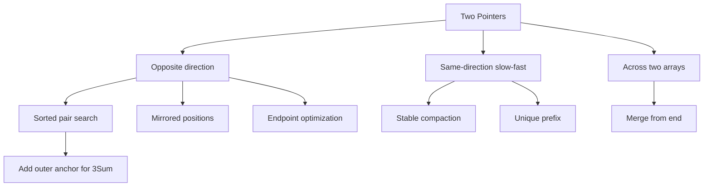

# Two Pointers Problem Revision Notes

> Revision flow used for every problem:
>
> ```text
> Problem statement
>       ↓
> Important clues
>       ↓
> Pointer form
>       ↓
> Pointer meanings
>       ↓
> Invariant
>       ↓
> Safe movement proof
>       ↓
> Algorithm
>       ↓
> Key Java
>       ↓
> Time + Space
> ```

---

## Implemented Java Files

- [SortedTwoSum.java](SortedTwoSum.java)
- [ValidPalindrome.java](ValidPalindrome.java)
- [RemoveElement.java](RemoveElement.java)
- [RemoveDuplicatesSortedArray.java](RemoveDuplicatesSortedArray.java)
- [MoveZeroes.java](MoveZeroes.java)
- [SortedSquares.java](SortedSquares.java)
- [MergeSortedArray.java](MergeSortedArray.java)
- [ValidPalindromeII.java](ValidPalindromeII.java)
- [ContainerWithMostWater.java](ContainerWithMostWater.java)
- [ThreeSum.java](ThreeSum.java)

---

# 1. Sorted Two Sum — Pair Existence

## Problem statement

Given a sorted integer array and a target, determine whether two different elements sum to the target.

Java file: [SortedTwoSum.java](SortedTwoSum.java)

```text
nums = [1, 3, 4, 6, 8, 10]
target = 14
→ true, because 4 + 10 = 14
```

## Important clues

```text
sorted array
two different elements
sum equals target
existence only
```

Hashing also gives expected `O(n)` time, but Two Pointers uses the ordering and only `O(1)` auxiliary space.

## Pointer form and meanings

**Opposite direction**

```text
left  → smallest remaining candidate
right → largest remaining candidate
```

Initialize:

```java
int left = 0;
int right = nums.length - 1;
```

## Invariant

> At the beginning of every iteration, every pair involving an index outside `[left, right]` has been proven unable to reach the target. If a valid pair remains, both indices are inside `[left, right]`.

## Safe movement proof

If:

```text
nums[left] + nums[right] < target
```

then `nums[right]` is the largest available partner for `nums[left]`. Even that pair is too small, so `nums[left]` cannot work with any remaining value. Move `left`.

The symmetric argument applies when the sum is too large: move `right`.

## Algorithm

```text
while left < right:
    sum = nums[left] + nums[right]

    if sum is too small:
        left++
    else if sum is too large:
        right--
    else:
        return true

return false
```

## Mistakes to remember

- `right` begins at `length - 1`, not `length`.
- `left < right` guarantees two different indices.
- “The sum is too small” is a movement rule, not the full safety proof.
- Use `long` for the sum if integer overflow is possible.

## Time + Space

```text
Time:  O(n)
Space: O(1)
```

---

# 2. Basic Palindrome Check

## Problem statement

Given a lowercase string, determine whether it reads the same from both directions.

Java file: [ValidPalindrome.java](ValidPalindrome.java)

```text
"racecar" → true
"abba"    → true
"abca"    → false
""        → true
```

## Important clues

```text
mirrored positions
compare outside characters
move toward the center
```

Sorting is irrelevant because movement follows positional symmetry, not numeric ordering.

## Pointer form and meanings

**Opposite direction**

```text
left  → next character from the beginning
right → mirrored character from the end
```

## Invariant

> Before every comparison, all mirrored character pairs outside `[left, right]` have already been confirmed equal.

## Algorithm

```text
while left < right:
    if characters differ:
        return false

    left++
    right--

return true
```

## Key Java

```java
if (s.charAt(left) != s.charAt(right)) {
    return false;
}
```

## Mistakes to remember

- Compare the character values at the two indices, not the indices themselves.
- When characters match, both pointers move.
- A frequency map cannot prove sequence order: `"abba"` and `"aabb"` have the same counts.
- A `while` loop communicates the opposite-direction template clearly.

## Time + Space

```text
Time:  O(n)
Space: O(1)
```

---

# 3. Remove Element — Stable In-Place Compaction

## Problem statement

Remove every occurrence of `val` in place while preserving the relative order of retained elements. Return `k`, the valid prefix length.

Java file: [RemoveElement.java](RemoveElement.java)

```text
nums = [5, 1, 5, 4]
val = 5

k = 2
relevant prefix = [1, 4]
```

Values after index `k - 1` do not matter.

## Important clues

```text
in place
remove selected values
preserve relative order
first k positions contain result
```

## Pointer form and meanings

**Same-direction slow-fast**

```text
fast → current original element being inspected
slow → next write position and retained count
```

## Invariant

> Before processing `fast`, `nums[0 ... slow-1]` contains exactly the elements not equal to `val` from original indices `0 ... fast-1`, in their original relative order.

## Algorithm

```text
slow = 0

for every fast index:
    if nums[fast] should be retained:
        nums[slow] = nums[fast]
        slow++

return slow
```

## Key Java

```java
if (nums[fast] != val) {
    nums[slow] = nums[fast];
    slow++;
}
```

## Mistakes to remember

- `fast` tracks how much input has been examined.
- `slow` is not merely a counter; it is also the next write position.
- Incrementing `slow` without writing only counts values and fails to build the valid prefix.
- Write first, then increment.
- The method returns `slow`, not a new array.

## Time + Space

```text
Time:  O(n)
Space: O(1)
```

---

# 4. Remove Duplicates from Sorted Array

## Problem statement

Given a sorted array, keep one copy of every distinct value in place and return the unique count `k`.

Java file: [RemoveDuplicatesSortedArray.java](RemoveDuplicatesSortedArray.java)

```text
nums = [0, 0, 1, 1, 1, 2, 2, 3, 3, 4]

k = 5
relevant prefix = [0, 1, 2, 3, 4]
```

## Important clues

```text
sorted
duplicates are adjacent
in place
unique prefix
```

Sorted order makes local comparison sufficient. In an unsorted array, previously seen values could appear anywhere and would normally require additional memory.

## Pointer form and meanings

**Same-direction slow-fast**

This solution uses the next-write-position convention:

```text
slow → number of unique values and next write position
fast → current input candidate
```

For a nonempty array:

```java
int slow = 1;
int fast = 1;
```

The first element is already the first unique value.

## Invariant

> Before processing `fast`, `nums[0 ... slow-1]` contains exactly the unique values from original indices `0 ... fast-1`, in sorted order.

## Detecting a new value

The last retained value is:

```java
nums[slow - 1]
```

Therefore:

```java
if (nums[fast] != nums[slow - 1]) {
    nums[slow] = nums[fast];
    slow++;
}
```

## Mistakes to remember

- Handle the empty array before assuming index `0` exists.
- Do not mix these two conventions:

| Meaning of `slow` | Start | Compare | Return |
| --- | ---: | --- | ---: |
| Next write position/count | `1` | `nums[slow - 1]` | `slow` |
| Last unique index | `0` | `nums[slow]` | `slow + 1` |

- A temporary “last value” variable is unnecessary because `nums[slow - 1]` already stores it.

## Time + Space

```text
Time:  O(n)
Space: O(1)
```

---

# 5. Move Zeroes

## Problem statement

Move all zeroes to the end in place while preserving the relative order of nonzero values.

Java file: [MoveZeroes.java](MoveZeroes.java)

```text
[0, 1, 0, 3, 12]
→ [1, 3, 12, 0, 0]
```

## Important clues

```text
in place
preserve nonzero order
move rejected values to the end
```

Opposite-end swapping can destroy relative order. For example, swapping the first zero with the final value could move `12` ahead of `1` and `3`.

## Pointer form and meanings

**Same-direction slow-fast**

```text
fast → examines every original value
slow → next position for a nonzero value
```

## Invariant

> Before processing `fast`, `nums[0 ... slow-1]` contains exactly the nonzero elements from original indices `0 ... fast-1`, in their original relative order.

## Two phases

### Phase 1: compact nonzero values

```java
if (nums[fast] != 0) {
    nums[slow] = nums[fast];
    slow++;
}
```

### Phase 2: fill the suffix

```java
while (slow < nums.length) {
    nums[slow] = 0;
    slow++;
}
```

After phase 1, the number of positions to fill is:

```text
nums.length - slow
```

The index range is:

```text
slow through nums.length - 1
```

## Mistakes to remember

- `slow` advances for a nonzero value, not for a zero.
- Count and index range are related but not identical descriptions.
- Two sequential scans remain `O(n)`: `O(n + n) = O(n)`.

## Time + Space

```text
Time:  O(n)
Space: O(1)
```

---

# 6. Squares of a Sorted Array

## Problem statement

Return the squares of a sorted array in sorted order.

Java file: [SortedSquares.java](SortedSquares.java)

```text
[-4, -1, 0, 3, 10]
→ [0, 1, 9, 16, 100]
```

Squaring from left to right produces `[16, 1, 0, 9, 100]`, which is not sorted.

## Important clues

```text
sorted input
negative values become positive after squaring
largest square can come from either endpoint
```

## Pointer form and meanings

**Opposite-direction input pointers plus an output index**

```text
left  → left remaining square candidate
right → right remaining square candidate
write → final position for the next-largest square
```

`write` is not another search pointer; it only identifies the output position.

## Invariant

> Before every comparison, all output positions after `write` contain the largest squares already selected, in their correct sorted positions.

## Movement rule

```text
compare nums[left]² with nums[right]²
write the larger square at result[write]
move only the endpoint that was consumed
write--
```

Do not write both endpoint squares at once. After selecting the larger endpoint, the newly exposed neighbor might be larger than the unselected endpoint.

## Loop condition

Use:

```java
while (left <= right)
```

When `left == right`, one final input value still needs to be written.

## Mistakes to remember

- Java does not use `^ 2` for squaring; `^` means bitwise XOR.
- Use multiplication: `nums[left] * nums[left]`.
- Handle equal squares with an `else` branch so a pointer always moves.
- `left < right` would leave the middle value unwritten.

## Time + Space

```text
Time: O(n)
Output array: O(n)
Extra working space excluding output: O(1)
```

Interview wording:

> The solution uses `O(n)` space for the required result and `O(1)` additional working space.

---

# 7. Merge Sorted Array

## Problem statement

Merge sorted `nums2` into sorted `nums1`. The first `m` positions of `nums1` are valid, and its final `n` positions are workspace.

Java file: [MergeSortedArray.java](MergeSortedArray.java)

```text
nums1 = [1, 2, 3, 0, 0, 0], m = 3
nums2 = [2, 5, 6],          n = 3

nums1 becomes [1, 2, 2, 3, 5, 6]
```

## Important clues

```text
two sorted arrays
nums1 has empty suffix capacity
modify nums1 in place
```

## Why merge from the end?

Writing a small `nums2` value at the beginning of `nums1` could overwrite an unprocessed valid `nums1` value. The suffix is safe workspace, so place the largest remaining value there.

## Pointer form and meanings

**Pointers across two arrays, writing from the end**

```java
int first = m - 1;          // last valid nums1 value
int second = n - 1;         // last nums2 value
int write = m + n - 1;      // final nums1 position
```

`nums1.length - n` equals `m`, the first workspace index. It is not the last valid index; that is `m - 1`.

## Invariant

> Before every comparison, positions `write + 1` through the end of `nums1` contain the largest merged values already selected, in their correct final positions.

## Algorithm

```text
while both inputs have remaining values:
    compare nums1[first] and nums2[second]
    write the larger at nums1[write]
    move the selected input pointer
    write--
```

Remaining values:

```text
nums2 exhausted → stop; remaining nums1 values are already positioned
nums1 exhausted → copy remaining nums2 values into nums1
```

## Mistakes to remember

- Always write into `nums1`, never into `nums2`.
- Use pointer-state loop conditions, not a separate counter moving against `write`.
- Guard both indices before comparing them.
- `break` is unnecessary when loop conditions express termination correctly.
- Three integer pointers require `O(1)` space, not `O(m+n)`.

## Time + Space

```text
Time:  O(m + n)
Space: O(1)
```

---

# 8. Valid Palindrome II

## Problem statement

Return whether a string can become a palindrome after deleting at most one character.

Java file: [ValidPalindromeII.java](ValidPalindromeII.java)

```text
"aba"   → true, no deletion
"abca"  → true, delete b or c
"deeee" → true, delete d
"abc"   → false
```

## Important clues

```text
mirrored comparison
at most one deletion
only the first mismatch creates a decision
```

## Pointer form and meanings

**Opposite direction with one branch at the first mismatch**

The main scan compares mirrored positions normally. At the first mismatch, a valid solution must delete one of those two mismatched characters.

## Invariant

> Before comparing `left` and `right`, all mirrored pairs outside `[left, right]` are equal and the one permitted deletion has not been used.

## Two possible deletion ranges

```java
// Simulate deleting the left character.
isPalindromeRange(s, left + 1, right)

// Simulate deleting the right character.
isPalindromeRange(s, left, right - 1)
```

The helper is an ordinary palindrome check over inclusive bounds. It does not delete anything, allocate a substring, or permit a second skip.

## Key Java

```java
return isPalindromeRange(s, left + 1, right)
        || isPalindromeRange(s, left, right - 1);
```

## Why not delete every possible character?

Trying every index and rechecking each resulting string costs `O(n²)` time and allocates new strings. All characters outside the first mismatch have already matched, so only the two mismatched characters can be the one deletion.

## Mistakes to remember

- Do not blindly choose `left++` or `right--`; either choice might be wrong.
- The range helper checks the entire remaining interval, not only its new endpoints once.
- Returning immediately into the helper checks ensures only one deletion is used.

## Time + Space

```text
Time:  O(n)
Space: O(1)
```

The main scan and at most two helper scans are linear: `O(n + n + n) = O(n)`.

---

# 9. Container With Most Water

## Problem statement

Choose two vertical lines that form the maximum-area container.

Java file: [ContainerWithMostWater.java](ContainerWithMostWater.java)

```text
height = [1, 8, 6, 2, 5, 4, 8, 3, 7]
answer = 49
```

For left index `1` and right index `8`:

```text
width = 8 - 1 = 7
usable height = min(8, 7) = 7
area = 7 × 7 = 49
```

## Important clues

```text
choose two boundaries
area depends on width and shorter height
need global maximum
```

## Pointer form and meanings

**Opposite direction**

```text
left and right → current container boundaries
maxArea        → best area examined so far, not a pointer
```

Starting at opposite ends gives the maximum initial width, but the decisive property is safe elimination of the shorter boundary.

## Invariant

> At the beginning of every iteration, `maxArea` is the largest area examined so far. Every pair involving a discarded boundary has been proven unable to exceed it; any better unexplored pair must lie inside `[left, right]`.

## Safe movement proof

Suppose the left line is shorter. Keeping it while moving `right` inward:

- decreases width;
- cannot increase usable height above the same short left line.

Therefore, no better container can keep that left boundary. Move `left` to seek a taller line.

When heights are equal, either pointer can move because keeping either equal-height boundary while reducing width cannot improve the current area.

## Key Java

```java
int area = (right - left)
        * Math.min(height[left], height[right]);

maxArea = Math.max(maxArea, area);
```

## Mistakes to remember

- Width is `right - left`, not `left - right`.
- Move the shorter boundary, not the taller boundary.
- `maxArea` retains history; `currentArea` represents only the current pair.
- `maxArea` is a variable but not a third pointer.
- Initialize `left` and `right` before the loop.

## Time + Space

```text
Time:  O(n)
Space: O(1)
```

---

# 10. 3Sum

## Problem statement

Return all unique triplets formed from different indices whose values sum to zero.

Java file: [ThreeSum.java](ThreeSum.java)

```text
nums = [-1, 0, 1, 2, -1, -4]

result:
[-1, -1, 2]
[-1, 0, 1]
```

## Important clues

```text
three values
sum equals zero
unique triplets
different indices
```

## Candidate pattern

**Sort + outer anchor + opposite-direction Two Pointers**

After sorting, fix:

```text
anchor = nums[i]
```

Then find two remaining values whose sum is:

```text
-anchor
```

This is not the across-two-arrays form. `left` and `right` operate within the same sorted array.

## Pointer setup

```java
for (int i = 0; i < nums.length - 2; i++) {
    int left = i + 1;
    int right = nums.length - 1;
}
```

The anchor begins at index `0`. The earlier walkthrough used `i = 1` only as one specific iteration example.

The anchor stops at `n - 3` because it must leave two later indices for `left` and `right`.

## Invariant

> For the current anchor, every valid unexplored pair lies inside `[left, right]`. Pairs involving discarded boundaries cannot reach the required complement.

## Movement rule

```text
sum < 0 → left++
sum > 0 → right--
sum = 0 → record triplet, move both, skip duplicates
```

After finding a valid pair:

- Keeping the same `left` and decreasing `right` makes the sum smaller.
- Keeping the same `right` and increasing `left` makes the sum larger.
- Equal repeated values would reproduce the same triplet.

Therefore, move both pointers and skip repeated values.

## Duplicate control

### Duplicate anchor

```java
if (i > 0 && nums[i] == nums[i - 1]) {
    continue;
}
```

### Duplicate left and right values

```java
while (left < right && nums[left] == nums[left - 1]) {
    left++;
}

while (left < right && nums[right] == nums[right + 1]) {
    right--;
}
```

Duplicate values are allowed when they occupy distinct indices, such as `[-1, -1, 2]`. Duplicate result triplets are not allowed.

## Early stopping

After sorting:

```java
if (nums[i] > 0) {
    break;
}
```

If the anchor is already positive, every later value is also positive, so a zero sum is impossible.

## Alternative approaches

| Approach | Time | Extra space | Main concern |
| --- | ---: | ---: | --- |
| Three nested loops | `O(n³)` | `O(1)` | Too slow |
| Anchor + HashSet | Expected `O(n²)` | `O(n)` | Deduplication is harder |
| Sort + Two Pointers | `O(n²)` | Sorting-dependent | Standard interview solution |

## Mistakes to remember

- The algorithm starts with anchor `i = 0`; `left = i + 1`.
- The anchor is not also the left pointer because indices must be distinct.
- The two inner pointers together perform one linear scan, not `O(n²)` for each anchor.
- Skip duplicate anchors and pointer values.
- Use `long` for the three-number sum when overflow is possible.
- Sorting modifies the input array.

## Time + Space

```text
Sorting: O(n log n)
Anchor + scans: O(n²)
Overall time: O(n²)
```

```text
Java primitive-array sorting working space: typically O(log n)
Returned triplets: O(k), where k is the number of unique answers
```

---

# Final Recognition Map



# Fast Decision Rules

```text
Sorted pair and comparison tells which side is impossible
→ Opposite-direction pointers
```

```text
Mirrored characters must match
→ Opposite-direction pointers
```

```text
Read every value and compact accepted values in place
→ Same-direction slow-fast pointers
```

```text
Two sorted sequences must be merged or synchronized
→ One pointer per sequence
```

```text
Three-number target
→ Sort, fix one anchor, solve remaining Two Sum with left/right
```

# Mistakes to Revisit

```text
[ ] Pointer role vs invariant
[ ] Movement rule vs safety proof
[ ] next write position vs last retained index
[ ] left < right vs left <= right
[ ] length vs final valid index
[ ] write before incrementing slow
[ ] required output space vs auxiliary space
[ ] preserve relative order during compaction
[ ] merge from the end to avoid overwriting input
[ ] skip only one mismatch in Valid Palindrome II
[ ] move the shorter container boundary
[ ] skip anchor and pointer duplicates in 3Sum
```

# Interview Explanation Template

```text
1. The clues suggest [pointer form] because ...
2. I define pointer A as ... and pointer B as ...
3. Before every iteration, the invariant is ...
4. When condition X occurs, moving pointer A is safe because ...
5. Each pointer moves monotonically, so time is ...
6. The algorithm stores ..., so auxiliary space is ...
```
