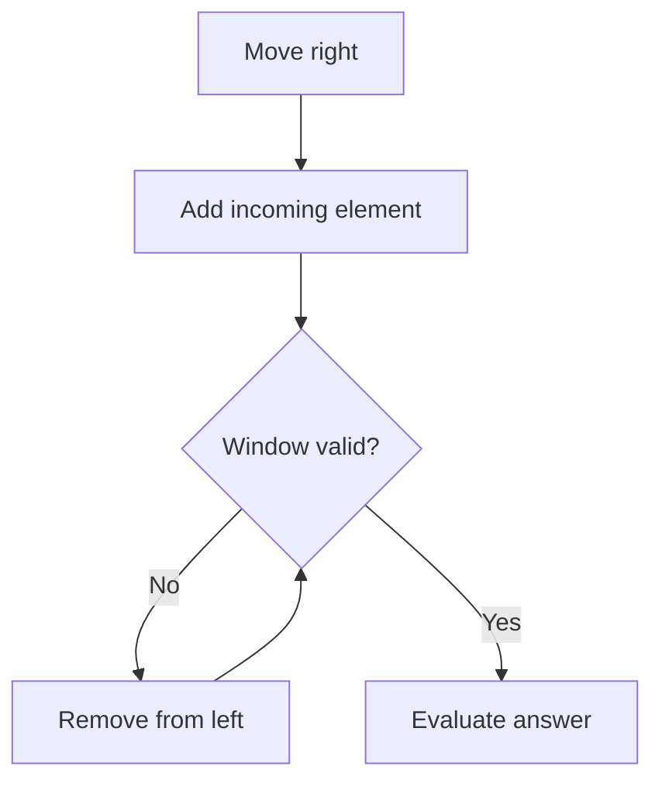
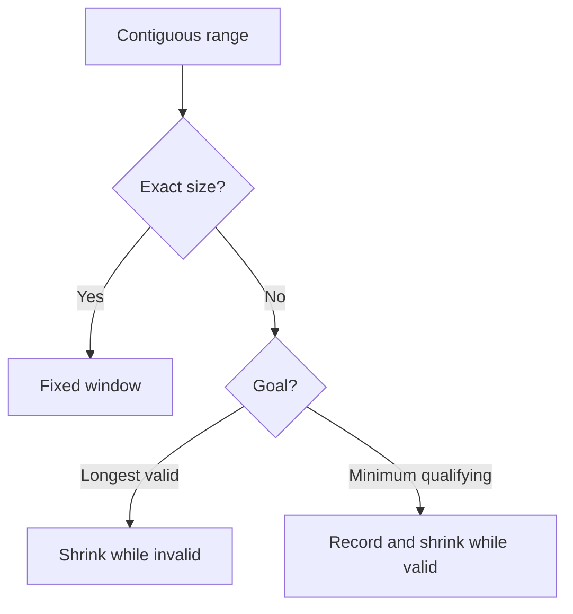

# Sliding Window

Sliding Window maintains a meaningful contiguous range while its boundaries move. Instead of recomputing every overlapping range from scratch, it updates a small amount of state when one element enters from the right or leaves from the left.

For the detailed problem-by-problem revision notes, see [problem-walkthrough.md](problem-walkthrough.md).

## Core Mental Model



```text
Sliding Window
= contiguous range [left, right]
+ state describing that range
+ expand/shrink rule
+ correctly timed answer update
```

## Pattern vs Form vs State vs Invariant

| Concept | Meaning | Example |
| --- | --- | --- |
| Pattern | Reusable algorithm family | Sliding Window |
| Window form | How size is controlled | Fixed size or variable size |
| Range | Elements currently included | `nums[left...right]` |
| Window state | Information about the current range | `windowSum`, `zeroCount`, frequency map |
| Validity condition | Rule the current range must satisfy | `zeroCount <= k` |
| Result state | Best answer processed so far | `maxLength`, `minLength`, `maxSum` |
| Invariant | What is guaranteed at a precise checkpoint | State exactly describes `[left, right]` |

A state definition should normally begin with:

```text
X equals ...
```

An invariant should normally begin with:

```text
After expansion and any required shrinking ...
```

## Recognition Clues

Sliding Window is a strong candidate when the problem contains several of these clues:

- A contiguous subarray or substring.
- Overlapping candidate ranges.
- A fixed length such as exactly `k`.
- A longest or shortest range satisfying a condition.
- A range aggregate such as sum, count, distinct values, or frequencies.
- Both boundaries can move only forward.

`subarray` or `substring` alone does not prove Sliding Window. The condition must support incremental updates when elements enter and leave.

## Window Size Formula

For the inclusive range `[left, right]`:

```text
window size = right - left + 1
```

`left` and `right` are indices. `nums[left]` and `nums[right]` are the boundary values.

## Two Main Forms

### 1. Fixed-size window

Use this when every candidate must contain exactly `k` elements.

```text
for every right:
    add incoming element to state

    if size > k:
        remove outgoing element from state
        left++

    if size == k:
        evaluate answer
```

Examples:

- Maximum sum of size `k`.
- Maximum average of size `k`.
- Maximum vowels in a substring of length `k`.
- Permutation in String, where the required size is `s1.length()`.

### 2. Variable-size window

Use this when the size depends on validity or qualification.

#### Longest valid window

```text
for every right:
    add incoming element

    while window is invalid:
        remove outgoing element
        left++

    update maximum length
```

Examples: no repeated characters, at most `k` zeroes, at most two distinct values.

#### Minimum qualifying window

```text
for every right:
    add incoming element

    while window qualifies:
        update minimum length
        remove outgoing element
        left++
```

Example: minimum subarray sum at least `target` when all numbers are positive.

## Answer Timing

| Objective | Shrink while | Evaluate |
| --- | --- | --- |
| Fixed size | `size > k` | When `size == k` |
| Longest valid | Window is invalid | After validity is restored |
| Minimum qualifying | Window is valid | Before each shrink |

Answer timing is part of the algorithm. A temporary oversized or invalid window must not update a longest-valid answer.

## Common Window States

| Requirement | Useful state |
| --- | --- |
| Sum or average | Running sum |
| At most `k` zeroes | Zero count |
| No repeated characters | `HashSet<Character>` |
| At most two distinct values | Frequency map |
| Exact character multiset | Target and window frequency maps or arrays |

Use a set for membership only. Use a map or frequency array when counts matter.

## State Update Rule

Every state must change symmetrically:

```text
Incoming element enters  → add its contribution
Outgoing element leaves  → remove its contribution
```

For a sum:

```java
windowSum += nums[right];
windowSum -= nums[left];
```

For a count:

```java
if (nums[right] == 0) {
    zeroCount++;
}

if (nums[left] == 0) {
    zeroCount--;
}
```

Moving `left` without updating the state breaks the connection between the range and its summary.

## Core Invariants

### Running aggregate

> After every expansion and removal, the state equals the aggregate of exactly the elements inside `[left, right]`.

### Longest valid window

> After the shrinking loop, `[left, right]` is valid, and `maxLength` is the largest valid length evaluated so far.

### Minimum qualifying window

> Before each shrinking step, `[left, right]` qualifies; every recorded length is therefore valid. When the loop ends, the current window no longer qualifies, while `minLength` preserves the best earlier valid length.

### Frequency map

> The map contains exactly the frequencies of values currently inside `[left, right]`; keys with frequency zero are removed.

## Why Positive Numbers Matter for Sum Windows

For Minimum Size Subarray Sum, all values are positive:

```text
move right → sum cannot decrease
move left  → sum cannot increase
```

This monotonic behavior makes the greedy shrinking rule safe. Negative values can make expansion decrease the sum or shrinking increase it, so the same window rule is not generally valid.

## Java Tools

```java
s.charAt(index)
s.length()
nums.length
Math.max(a, b)
Math.min(a, b)
set.contains(value)
map.getOrDefault(key, 0)
map.size()
map.equals(otherMap)
```

For a `char`, a concise vowel helper is:

```java
return "aeiou".indexOf(c) >= 0;
```

`String.contains` accepts a `CharSequence`, not a primitive `char`. An array also has no general-purpose `contains` method.

## Complexity Memory Rule

Nested loops do not automatically mean `O(n²)`. If `right` moves forward at most `n` times and `left` also moves forward at most `n` times:

```text
total pointer movements <= 2n
Time: O(n)
```

Space depends on the state:

- Only numeric counters: `O(1)`.
- Set or map whose size can grow with the input: `O(n)`.
- Map restricted to at most two fruit types: `O(1)`.
- Fixed alphabet arrays: `O(1)` for a constant alphabet.

## Implemented Problems

| Problem | Form | Main state | Java |
| --- | --- | --- | --- |
| Maximum Sum Subarray of Size K | Fixed | Running sum | [MaxSumSubarrayOfSizeK.java](MaxSumSubarrayOfSizeK.java) |
| Maximum Average Subarray I | Fixed | Running sum | [MaximumAverageSubarray.java](MaximumAverageSubarray.java) |
| Maximum Number of Vowels | Fixed | Vowel count | [MaximumNumberOfVowels.java](MaximumNumberOfVowels.java) |
| Minimum Size Subarray Sum | Variable, minimum | Running sum | [MinimumSizeSubarraySum.java](MinimumSizeSubarraySum.java) |
| Longest Substring Without Repeating Characters | Variable, longest | Character set | [LongestSubstringWithoutRepeatingCharacters.java](LongestSubstringWithoutRepeatingCharacters.java) |
| Max Consecutive Ones III | Variable, longest | Zero count | [MaxConsecutiveOnesIII.java](MaxConsecutiveOnesIII.java) |
| Fruit Into Baskets | Variable, longest | Frequency map | [FruitIntoBaskets.java](FruitIntoBaskets.java) |
| Permutation in String | Fixed | Two frequency maps | [PermutationInString.java](PermutationInString.java) |

## Common Mistakes

- Treating pointer values as indices: `left = nums[left]` is not the same as `left`.
- Forgetting `+1` in the inclusive size formula.
- Shrinking at `size == k` instead of evaluating that valid window.
- Shrinking at `count >= k` when the rule allows at most `k`; invalidity begins at `count > k`.
- Using `if` when several left elements may need to leave; use `while` for repeated shrinking.
- Updating a longest answer before validity is restored.
- Updating a minimum answer after destroying the last qualifying window.
- Incrementing `left` only when the outgoing value affects a count; `left` moves on every shrinking iteration.
- Removing a frequency-map key before its count reaches zero.
- Mutating the target-frequency map while sliding the window.
- Initializing a maximum sum to `0` when every valid window may be negative.
- Initializing a minimum length to `0`, which already looks optimal.
- Writing `(double) (maxSum / k)`; integer division has already occurred.
- Calling one extra variable `O(n)` space; a fixed number of variables is `O(1)`.

## Fast Decision Map



## Interview Articulation Template

> Because the problem asks for a contiguous range with **[fixed size / a validity condition]**, I use **[fixed / variable] Sliding Window**. I maintain **[state]**, which equals **[precise meaning]** for `[left, right]`. For every `right`, I add the incoming element. I shrink when **[exact condition]** by **[state removal]** and incrementing `left`. I update **[answer]** **[evaluation timing]**. Each element enters and leaves at most once, so the time complexity is `O(n)`, with **[space]** auxiliary space.

## Revision Checklist

- Can I identify the exact clues instead of saying only "subarray"?
- Can I distinguish pattern, form, state, condition, result, and invariant?
- Can I define `left` and `right` as indices?
- Can I state what enters and what leaves?
- Can I write the exact shrinking inequality?
- Can I explain why answer timing is correct?
- Can I justify `O(n)` even when the code contains nested loops?
- Can I explain the required data structure from the information the window must remember?

## Terminology Note

`i-th` means "the item at position `i`." The hyphen is English notation; it is not subtraction or Java syntax.
