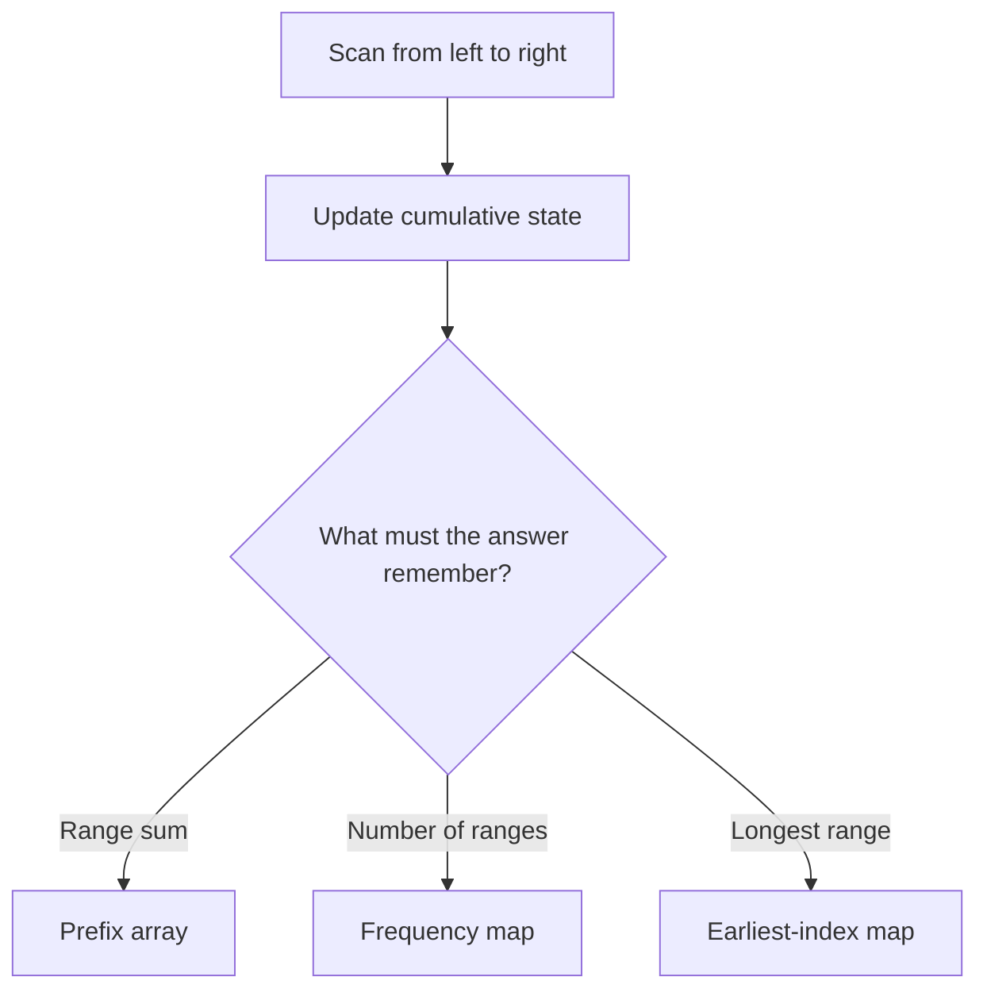
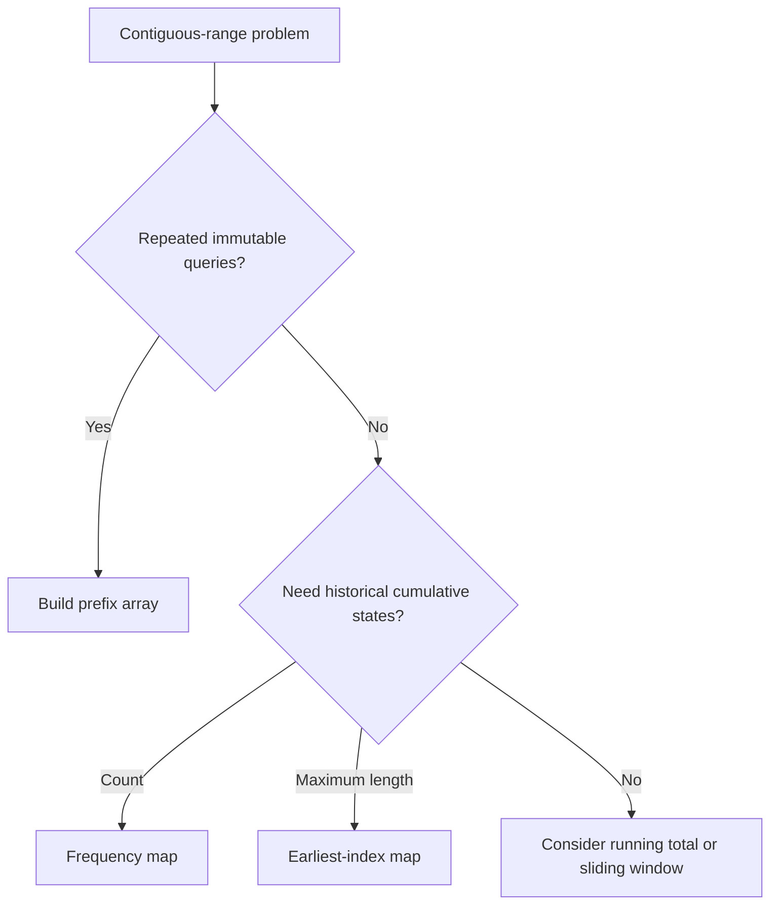

# Pattern 04 — Prefix Sum

Prefix Sum turns repeated work over contiguous ranges into reusable cumulative state. Build information while scanning once, then answer a range query or compare the current prefix with earlier prefixes.

For the full problem-by-problem reasoning, traces, invariants, and articulation notes, see [problem-walkthrough.md](./problem-walkthrough.md).

## Core Mental Model



A prefix describes everything before a boundary. Two boundaries isolate the values between them.

## Primary Convention: Leading Zero

For all prefix-array implementations in this folder:

```text
prefix[0] = 0
prefix[i + 1] = prefix[i] + nums[i]
```

Therefore:

```text
prefix[p] = sum of the first p elements
          = sum of nums[0..p - 1]
```

Example:

```text
nums:      [ 2, -1,  3,  4]
index:       0   1   2   3
prefix: [0, 2,  1,  4,  8]
position:  0  1   2   3   4
```

To find the inclusive sum from `left` through `right`:

```text
prefix[right + 1] = nums[0] + ... + nums[right]
prefix[left]      = nums[0] + ... + nums[left - 1]

sum(left..right) = prefix[right + 1] - prefix[left]
```

When `left == 0`, `prefix[left]` is the empty-prefix sum `0`, so the same formula works without a special condition.

## Recognition Clues

Consider Prefix Sum when a problem asks about:

- repeated sums over immutable ranges;
- a contiguous subarray with an exact sum;
- the number of qualifying subarrays;
- a balance between two categories;
- a sum divisible by `k`;
- historical cumulative state, especially when negative values make a sliding window unsafe.

The word *subarray* alone is not enough. First determine whether the condition supports monotonic window movement or requires comparison with earlier cumulative states.

## Prefix Sum Forms

| Goal | State kept while scanning | Lookup or calculation | Stored map value |
|---|---|---|---|
| Repeated range sums | Full prefix array | `prefix[right + 1] - prefix[left]` | None |
| Pivot / left-right balance | `totalSum`, `leftSum` | `rightSum = totalSum - leftSum - nums[i]` | None |
| Count subarrays with sum `k` | Current prefix sum | Earlier prefix `current - k` | Frequency |
| Longest balanced subarray | Transformed balance | Same balance seen earlier | Earliest index |
| Count sums divisible by `k` | Normalized prefix remainder | Same remainder seen earlier | Frequency |

## What Each Piece Means

| Term | Precise meaning |
|---|---|
| Prefix definition | What one prefix position represents |
| Current state | Cumulative information after consuming the current element |
| Lookup condition | Which earlier state makes the enclosed range valid |
| Result state | Count, maximum length, index, or range sum being produced |
| Invariant | What is guaranteed at a precise point during every iteration |

An objective such as “find the maximum length” is not an invariant.

## Frequency Map or Earliest-Index Map?

| Question asked | What the map must preserve | Why |
|---|---|---|
| How many valid subarrays? | Frequency of every earlier state | Every occurrence creates a distinct left boundary |
| What is the maximum length? | Earliest index of every state | The earliest boundary gives the longest distance |

The initial entry also depends on the map's meaning:

| Use | Initial entry | Interpretation |
|---|---|---|
| Count ranges | `{0 -> 1}` | The empty prefix with value zero has occurred once |
| Maximize length | `{0 -> -1}` | Balance zero exists immediately before index zero |

## Exact-Sum Derivation

If the current prefix ends at the current element:

```text
currentPrefix - earlierPrefix = k
```

Rearranging gives the earlier boundary to search for:

```text
earlierPrefix = currentPrefix - k
```

If that earlier prefix occurred three times, there are three distinct subarrays ending at the current element. This is why a set is insufficient when the result is a count.

Always count matching earlier prefixes before recording the current prefix. A left boundary must occur before the current right boundary.

## Divisibility Derivation

For prefix sums `a` and `b`:

```text
(a - b) is divisible by k
```

exactly when `a` and `b` have the same normalized remainder modulo `k`.

Java can produce a negative remainder, so normalize it:

```java
int remainder = sumSoFar % k;
if (remainder < 0) {
    remainder += k;
}
```

## Prefix Sum vs. Sliding Window

| Prefix Sum | Sliding Window |
|---|---|
| Compares cumulative state at different boundaries | Maintains one active range |
| Often uses an array or historical-state map | Adds an incoming value and removes an outgoing value |
| Handles exact sums with negative values | Usually needs a condition that changes predictably as boundaries move |
| Useful for counts, balances, and range queries | Useful for fixed-size windows or monotonic grow/shrink rules |

Sliding Window is not rejected because multiple subarrays exist. It is rejected when moving a boundary does not predictably move the condition toward or away from validity.

## Useful Invariants

### Prefix array

> After processing `nums[i]`, `prefix[i + 1]` equals the sum of `nums[0..i]`.

### Exact-sum frequency map

> Before recording the current prefix, the map stores the frequencies of all prefix sums at earlier boundaries.

### Earliest-index map

> After processing index `i`, the map stores the earliest index at which every encountered balance occurred.

### Remainder frequency map

> Before recording the current remainder, the map stores how often every normalized remainder occurred at earlier prefix boundaries.

## Complexity

| Technique | Time | Auxiliary space |
|---|---:|---:|
| Build prefix array | `O(n)` | `O(n)` |
| One range query after preprocessing | `O(1)` | `O(1)` additional |
| `q` queries including preprocessing | `O(n + q)` | `O(n)` |
| One-pass running total | `O(n)` | `O(1)` |
| Prefix state with hash map | `O(n)` average | `O(n)` |
| Enumerate every range using prefix queries | `O(n^2)` | `O(n)` |

A prefix array or hash map that grows with the input is not `O(1)` auxiliary space. In production code, use `long` when cumulative sums can exceed Java's `int` range.

## Implemented Problems

| Problem | Main lesson | Solution |
|---|---|---|
| LeetCode 303 — Range Sum Query: Immutable | Leading zero and constant-time range queries | [NumArray.java](./NumArray.java) |
| LeetCode 724 — Find Pivot Index | Derive right sum from total and left sum | [FindPivotIndex.java](./FindPivotIndex.java) |
| LeetCode 560 — Subarray Sum Equals K | Exact-sum lookup with a frequency map | [SubarraySumEqualsK.java](./SubarraySumEqualsK.java) |
| LeetCode 560 — Prefix-array alternative | Constant-time range calculation still leaves quadratic range enumeration | [SubarraySumEqualsKPrefixArray.java](./SubarraySumEqualsKPrefixArray.java) |
| LeetCode 525 — Contiguous Array | Transform values and store earliest indices | [ContiguousArray.java](./ContiguousArray.java) |
| LeetCode 974 — Subarray Sums Divisible by K | Equal normalized remainders and frequency counting | [SubarraySumsDivisibleByK.java](./SubarraySumsDivisibleByK.java) |

## Common Mistakes

- Mixing a prefix position with a `nums` index.
- Mixing inclusive and leading-zero conventions.
- Allocating `n` prefix entries instead of `n + 1`.
- Writing `prefix[right] - prefix[left]` for an inclusive range.
- Forgetting the empty prefix.
- Using a set when duplicate prefix states must all be counted.
- Storing frequency when the goal requires the earliest index, or vice versa.
- Overwriting the earliest index for a repeated balance.
- Updating the map before counting earlier matches.
- Replacing `count += frequency` with `count = frequency + 1`.
- Forgetting to normalize negative remainders in Java.
- Describing the algorithm's goal instead of stating its invariant.

## Fast Decision Map



## Interview Articulation Template

> Because the problem asks for information about contiguous ranges, I consider Prefix Sum. I define my cumulative state as ____. A valid range exists when the current state and an earlier state satisfy ____. I store ____ because the result asks for ____. The invariant is ____. Therefore each element is processed once, giving `O(n)` time and ____ auxiliary space.

## Revision Checklist

- Can I define every prefix entry without using an ambiguous phrase such as “the value”?
- Can I derive `prefix[right + 1] - prefix[left]`?
- Can I explain why `left == 0` needs no special branch?
- Can I choose between a frequency map and an earliest-index map?
- Can I explain `{0 -> 1}` versus `{0 -> -1}`?
- Can I justify lookup-before-update order?
- Can I explain why negative numbers or modulo state may invalidate sliding-window reasoning?
- Can I state preprocessing, query, total, and auxiliary-space costs separately?
