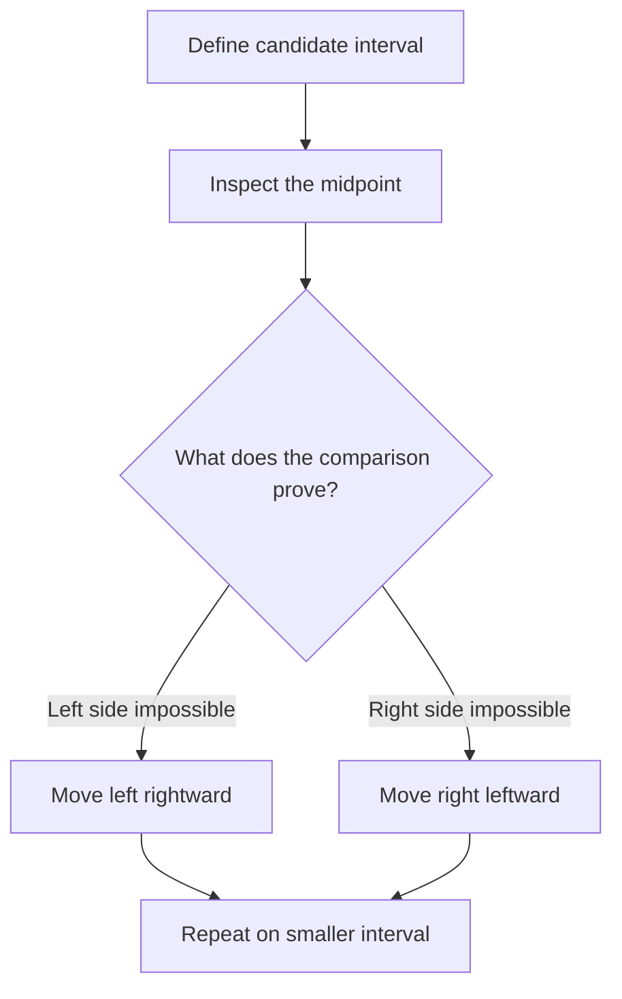
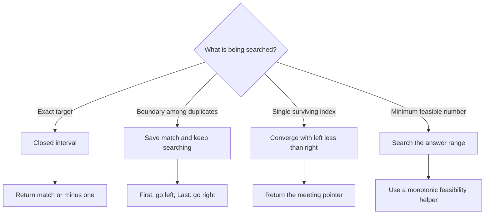

# Pattern 05 — Binary Search

Binary search is not merely “searching a sorted array.” Its deeper idea is:

> Use a comparison or monotonic condition to prove that one part of the current candidate space cannot contain the answer, then discard that part.

The candidate space may be array indices, a rotated array, a local slope, or a numerical range of possible answers. The implementation becomes reliable when the interval meaning and pointer updates are chosen together.

For worked examples and traces, see [problem-walkthrough.md](problem-walkthrough.md).

## Recognition Clues

Consider binary search when:

- The input is sorted, partially sorted, or rotated.
- The question asks for an index, insertion position, first occurrence, or last occurrence.
- A comparison reveals which half cannot contain the answer.
- The problem asks for a minimum or maximum feasible value.
- Feasibility changes only once across an ordered answer space, such as `false, false, true, true`.
- A local comparison, such as `nums[mid]` versus `nums[mid + 1]`, reveals a safe direction.

Sorted input is a common clue, but it is not the full rule. The essential requirement is an ordered decision that permits safe elimination.

## Core Mental Model



At every iteration, be able to say:

1. What does `[left, right]` represent?
2. Can `mid` still be the answer?
3. Which candidates are now impossible?
4. Does the update make the interval strictly smaller?

## Three Reusable Templates

### 1. Exact search in a closed interval

Use this when looking for an exact target and returning immediately on equality.

```java
int left = 0;
int right = nums.length - 1;

while (left <= right) {
    int mid = left + (right - left) / 2;

    if (nums[mid] < target) {
        left = mid + 1;
    } else if (nums[mid] > target) {
        right = mid - 1;
    } else {
        return mid;
    }
}

return -1;
```

The interval is inclusive. When `left == right`, one candidate remains and must still be checked. Therefore the loop condition is `left <= right`.

### 2. Converging on one surviving candidate

Use this when every iteration preserves an answer candidate and the pointers should meet on it.

```java
int left = 0;
int right = nums.length - 1;

while (left < right) {
    int mid = left + (right - left) / 2;

    if (conditionSendsUsRight(mid)) {
        left = mid + 1;
    } else {
        right = mid;
    }
}

return left;
```

Because `right = mid` can preserve `mid`, use `left < right`. At termination, `left == right`, so return either pointer—not a stale `mid`.

### 3. Binary search on the answer

Use this when searching a numerical range rather than an actual array.

```java
int left = minimumPossibleAnswer;
int right = maximumPossibleAnswer;

while (left < right) {
    int mid = left + (right - left) / 2;

    if (isFeasible(mid)) {
        right = mid;
    } else {
        left = mid + 1;
    }
}

return left;
```

The helper creates a monotonic sequence:

```text
not feasible ... not feasible | feasible ... feasible
```

The goal is the first feasible value.

## Interval Choices Must Stay Consistent

| Question | Closed exact-search interval | Converging-candidate interval |
| --- | --- | --- |
| Initial bounds | `left = 0`, `right = n - 1` | `left = 0`, `right = n - 1` |
| Loop | `left <= right` | `left < right` |
| Exclude `mid` on left side | `right = mid - 1` | Depends on proof |
| Preserve `mid` as candidate | Usually unnecessary | `right = mid` |
| Termination | `left > right` | `left == right` |
| Typical return | Match or sentinel | `left` or `right` |

Do not copy one line from one template into another without checking the interval invariant.

## Safe Midpoint

Prefer:

```java
int mid = left + (right - left) / 2;
```

It is algebraically equivalent to `(left + right) / 2`, but avoids overflow when both pointers are large.

## Important Variations

### Insertion position

After an unsuccessful exact search, `left` is the first index whose value could be at least the target. Every index before it has been proven too small. Therefore `left` is the insertion position.

### First and last occurrence

Equality does not end the search when duplicates may contain a better boundary:

- First occurrence: save `mid`, then continue left with `right = mid - 1`.
- Last occurrence: save `mid`, then continue right with `left = mid + 1`.

The saved answer must be preserved because a later search may find no additional match.

### Rotated sorted arrays

In a rotated sorted array with distinct values, at least one half around `mid` is sorted.

- If `nums[left] <= nums[mid]`, the left half is sorted.
- Otherwise, the right half is sorted.

First determine the sorted half. Then test whether the target lies inside that half's value range. This range test tells you which half can safely be discarded.

### Local slope search

For a peak element, compare adjacent values:

- `nums[mid] < nums[mid + 1]`: the slope rises, so a peak exists to the right.
- Otherwise: `mid` may itself be a peak, so preserve it with `right = mid`.

### Search on a numerical answer space

Koko Eating Bananas and Capacity to Ship Packages do not provide an array of possible answers. We create an ordered range:

- Koko speed: `[1, maxPile]`
- Ship capacity: `[maxWeight, sumOfWeights]`

Then a greedy helper determines whether a candidate is feasible.

## Ceiling Division

Koko needs the number of whole hours required for each pile:

```java
long hours = (pile - 1L) / speed + 1;
```

This equals `ceil(pile / speed)` using integer arithmetic. The `1L` promotes the calculation to `long`, helping prevent overflow during accumulation.

For example:

- `pile = 8`, `speed = 4` gives `2` hours.
- `pile = 9`, `speed = 4` gives `3` hours.

The tempting expression `pile / speed + 1` is wrong when the pile divides evenly by the speed.

## Implemented Problems

| Problem | Main lesson | Solution |
| --- | --- | --- |
| Binary Search | Closed interval and exact match | [BinarySearch.java](BinarySearch.java) |
| Search Insert Position | `left` becomes the insertion boundary | [SearchInsertPosition.java](SearchInsertPosition.java) |
| First Occurrence | Save a match and continue left | [FindFirstOccurrence.java](FindFirstOccurrence.java) |
| Last Occurrence | Save a match and continue right | [FindLastOccurrence.java](FindLastOccurrence.java) |
| First and Last Position | Compose two boundary searches | [FindFirstAndLastPosition.java](FindFirstAndLastPosition.java) |
| Minimum in Rotated Sorted Array | Preserve the possible minimum | [FindMinimumInRotatedSortedArray.java](FindMinimumInRotatedSortedArray.java) |
| Search in Rotated Sorted Array | Identify the sorted half | [SearchInRotatedSortedArray.java](SearchInRotatedSortedArray.java) |
| Find Peak Element | Follow a local slope | [FindPeakElement.java](FindPeakElement.java) |
| Koko Eating Bananas | First feasible speed | [KokoEatingBananas.java](KokoEatingBananas.java) |
| Ship Packages Within D Days | First feasible capacity | [CapacityToShipPackagesWithinDDays.java](CapacityToShipPackagesWithinDDays.java) |

## Complexity

| Variation | Time | Extra space |
| --- | --- | --- |
| Exact or boundary search | `O(log n)` | `O(1)` |
| Rotated-array search | `O(log n)` | `O(1)` |
| Peak search | `O(log n)` | `O(1)` |
| Koko | `O(n log M)`, `M = max(piles)` | `O(1)` |
| Ship packages | `O(n log S)`, `S = sum(weights)` | `O(1)` |

In answer-space problems, each midpoint requires an `O(n)` feasibility scan.

## Common Mistakes

- Confusing an index with the value stored at that index.
- Starting a closed interval with `right = nums.length` instead of `nums.length - 1`.
- Using `left < right` for exact search and skipping the final candidate.
- Combining `left <= right` with `right = mid`, which can create an infinite loop.
- Returning `mid` after a convergence loop even though `mid` may be stale.
- Returning immediately on equality when the problem asks for the first or last occurrence.
- Saving a boundary match but forgetting to continue the search.
- In rotated search, checking only value order without testing whether the target lies in the sorted range.
- Returning `-1` inside one iteration of rotated search before the candidate interval is empty.
- Treating Koko as total bananas divided by total hours; each pile consumes a separate whole number of hours.
- Computing ceiling division as `pile / speed + 1`.
- Accumulating large totals in `int` when `long` is safer.

## Decision Map



## Articulation Template

Before coding, explain the solution in this order:

1. **Candidate space:** “The answer must lie between ___ and ___.”
2. **Invariant:** “If an answer exists, the current interval still contains it.”
3. **Midpoint evidence:** “This comparison proves ___ cannot contain the answer.”
4. **Pointer update:** “Therefore I set ___ to ___.”
5. **Termination:** “The loop ends when ___, which means ___.”
6. **Return value:** “I return ___ because ___.”

Clear articulation should name exact indices and inequalities. For example: “Because `nums[mid] < target`, every index from `left` through `mid` is too small, so the next candidate is `mid + 1`.”

## Revision Checklist

- Can I state exactly what `[left, right]` means?
- Do I know whether `mid` remains a possible answer in each branch?
- Does every update strictly reduce the interval?
- Is the loop condition consistent with those updates?
- Am I returning an index or a value?
- For boundary search, did I preserve the best answer found so far?
- For answer search, is the feasibility predicate monotonic?
- Did I choose safe lower and upper bounds?
- Could any total overflow an `int`?

## Suggested Next Practice

After these templates feel natural, revisit binary search on answer with harder partitioning problems such as Split Array Largest Sum. The main new challenge is usually the feasibility helper, not the binary-search loop itself.
